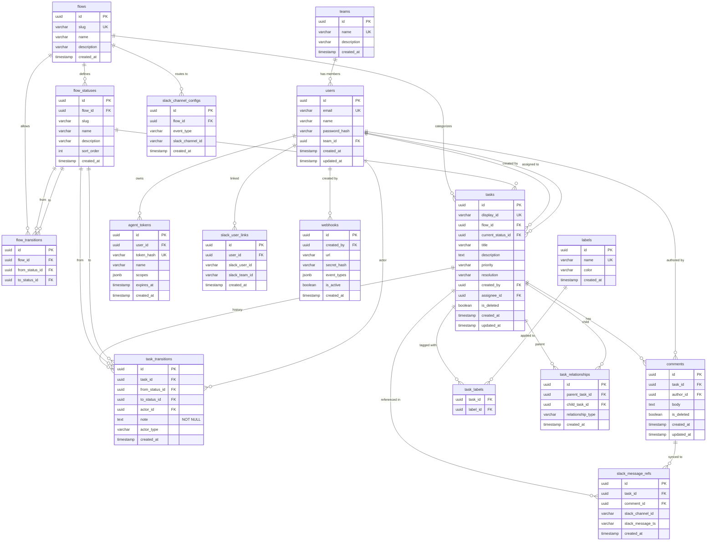

# Database Schema

TaskFlow uses a normalized relational database following best practices. The schema derives from the task flows, teams, permissions, and integration requirements defined in the other design documents.

---

## Entity-Relationship Diagram

---

## Table Descriptions

### Core Domain

**`teams`** — The four team types (Engineer, Product, User, Agent). Seeded on deployment, not user-created.

**`users`** — All human users and agent identities. Each belongs to exactly one team. Agent "users" have `is_agent: true` (or can be identified by team membership).

**`flows`** — The task flow types (Bug, Feature, Improvement). Seeded on deployment. Slug is used in URLs and API (`bug`, `feature`, `improvement`).

**`flow_statuses`** — Ordered statuses for each flow. `sort_order` defines the default progression. E.g., Bug flow has Triage(1), Investigate(2), Approve(3), Resolve(4), Validate(5), Closed(6).

**`flow_transitions`** — Allowed transitions between statuses within a flow. Encodes both forward progression and allowed backward transitions. If a row exists for (from_status, to_status), the transition is structurally valid. Permission checks happen at the application layer.

**`tasks`** — The core work item. `display_id` is the human-readable ID (e.g., `BUG-42`, `FEAT-7`). `is_deleted` supports soft delete. `priority` is an enum: `critical`, `high`, `medium`, `low`. `resolution` is nullable — set only when the task reaches Closed status. Values depend on flow type (see [taskflows.md](taskflows.md#task-resolution)): e.g., `fixed`, `invalid`, `duplicate`, `rejected`, `completed`, `deferred`, `wont_fix`, `cannot_reproduce`.

**`task_transitions`** — Immutable audit log of every status change, forming the **flow audit history**. Each row records who moved the task, when, and — critically — **why** via the required `note` field. `from_status_id` is null for the initial creation event. `actor_type` distinguishes human vs. agent actors (`human`, `agent`, `system`). Notes are required (NOT NULL) and immutable — they cannot be edited or deleted after creation. The full sequence of transition records for a task constitutes its complete audit trail.

### Collaboration

**`comments`** — Comments on tasks. Soft-deletable. Supports both human and agent authors.

**`labels`** — Reusable tags for categorization. Applied to tasks via the junction table.

**`task_labels`** — Many-to-many junction between tasks and labels. Composite primary key on `(task_id, label_id)`.

**`task_relationships`** — Links between tasks (parent/child, blocks/blocked-by, relates-to). Enables epic-like grouping without a separate flow. `relationship_type` enum: `parent_child`, `blocks`, `relates_to`.

### Authentication

**`agent_tokens`** — Scoped API tokens for agent access. `scopes` is a JSONB array of permitted actions (e.g., `["tasks:read", "tasks:transition", "comments:create"]`). Token value is hashed; the plaintext is shown once at creation.

### Integrations

**`slack_user_links`** — Maps TaskFlow users to Slack identities for attribution and permission checking.

**`slack_channel_configs`** — Routing rules for notifications: which flow + event type goes to which Slack channel.

**`slack_message_refs`** — Tracks which Slack messages correspond to which tasks/comments for thread sync and deduplication.

**`webhooks`** — External webhook subscriptions. `event_types` is a JSONB array of subscribed events. `secret_hash` is used to sign outgoing payloads.

---

## Indexes

Key indexes beyond primary keys:

| Table | Index | Purpose |
|-------|-------|---------|
| `tasks` | `(flow_id, current_status_id)` | Filter tasks by flow and status |
| `tasks` | `(assignee_id)` | "My tasks" queries |
| `tasks` | `(created_by)` | "Tasks I created" queries |
| `tasks` | `(display_id)` | Lookup by human-readable ID |
| `tasks` | `(is_deleted)` partial index where `false` | Exclude soft-deleted from default queries |
| `tasks` | `(resolution)` partial index where not null | Filter by resolution outcome |
| `task_transitions` | `(task_id, created_at)` | Task flow audit history timeline |
| `task_transitions` | `(actor_type, task_id)` | Filter transitions by actor type (human vs. agent) |
| `comments` | `(task_id, created_at)` | Comment threads |
| `task_labels` | `(label_id)` | Find all tasks with a given label |
| `slack_message_refs` | `(slack_channel_id, slack_message_ts)` | Dedup incoming Slack events |

Full-text search on `tasks.title` and `tasks.description` via PostgreSQL `tsvector` / GIN index. Full-text search on `task_transitions.note` via a separate GIN index to support searching audit history (e.g., finding all tasks where an agent mentioned a specific module or error).

---

## Notes

- **UUIDs as primary keys** — consistent with dashboard-backend, avoids enumeration attacks on public-facing IDs.
- **`display_id` generation** — application-layer counter per flow (e.g., `BUG-{next_seq}`). Stored as a unique column, not the PK.
- **Soft deletes** — tasks and comments use `is_deleted` rather than physical deletion. This preserves audit trail integrity.
- **JSONB for flexible fields** — `agent_tokens.scopes` and `webhooks.event_types` use JSONB for flexibility without requiring additional tables.
- **Timestamps** — all tables include `created_at`. Mutable tables include `updated_at`.
