# Database Schema

TaskFlow uses a normalized relational database following best practices. The schema derives from the task flows, teams, permissions, and integration requirements defined in the other design documents.

---

## Entity-Relationship Diagram

```mermaid
erDiagram
    users {
        uuid id PK
        varchar email UK
        varchar display_name
        varchar actor_type
        varchar status
        varchar timezone
        timestamp created_at
        timestamp updated_at
    }

    teams {
        uuid id PK
        varchar name UK
        varchar description
        timestamp created_at
    }

    user_teams {
        uuid user_id FK
        uuid team_id FK
        boolean is_primary
        uuid granted_by FK
        timestamp granted_at
    }

    oauth_connections {
        uuid id PK
        uuid user_id FK
        varchar provider
        varchar provider_user_id
        timestamp last_used_at
        timestamp created_at
    }

    api_tokens {
        uuid id PK
        uuid user_id FK
        varchar token_hash UK
        varchar token_name
        varchar token_type
        timestamp expires_at
        timestamp last_used_at
        timestamp created_at
    }

    user_preferences {
        uuid id PK
        uuid user_id FK
        varchar notification_level
        boolean notify_on_mention
        boolean notify_on_assignment
        boolean notify_on_status_change
        varchar default_flow_filter
        varchar default_priority_filter
        timestamp created_at
        timestamp updated_at
    }

    flows {
        uuid id PK
        varchar slug UK
        varchar name
        varchar description
        timestamp created_at
    }

    flow_statuses {
        uuid id PK
        uuid flow_id FK
        varchar slug
        varchar name
        varchar description
        int sort_order
        timestamp created_at
    }

    flow_transitions {
        uuid id PK
        uuid flow_id FK
        uuid from_status_id FK
        uuid to_status_id FK
    }

    tasks {
        uuid id PK
        varchar display_id UK
        uuid flow_id FK
        uuid current_status_id FK
        varchar title
        text description
        varchar priority
        varchar resolution
        uuid created_by FK
        uuid assignee_id FK
        boolean is_deleted
        timestamp created_at
        timestamp updated_at
    }

    task_transitions {
        uuid id PK
        uuid task_id FK
        uuid from_status_id FK
        uuid to_status_id FK
        uuid actor_id FK
        text note "NOT NULL"
        varchar actor_type
        timestamp created_at
    }

    comments {
        uuid id PK
        uuid task_id FK
        uuid author_id FK
        text body
        boolean is_deleted
        timestamp created_at
        timestamp updated_at
    }

    labels {
        uuid id PK
        varchar name UK
        varchar color
        timestamp created_at
    }

    task_labels {
        uuid task_id FK
        uuid label_id FK
    }

    task_relationships {
        uuid id PK
        uuid parent_task_id FK
        uuid child_task_id FK
        varchar relationship_type
        timestamp created_at
    }

    comment_mentions {
        uuid id PK
        uuid comment_id FK
        uuid mentioned_user_id FK
        uuid task_id FK
        timestamp created_at
    }

    transition_mentions {
        uuid id PK
        uuid task_transition_id FK
        uuid mentioned_user_id FK
        uuid task_id FK
        timestamp created_at
    }

    scopes {
        uuid id PK
        varchar slug UK
        varchar description
        timestamp created_at
    }

    api_token_scopes {
        uuid api_token_id FK
        uuid scope_id FK
    }

    slack_user_links {
        uuid id PK
        uuid user_id FK
        varchar slack_user_id
        varchar slack_team_id
        timestamp created_at
    }

    slack_channel_configs {
        uuid id PK
        uuid flow_id FK
        varchar event_type
        varchar slack_channel_id
        timestamp created_at
    }

    slack_message_refs {
        uuid id PK
        uuid task_id FK
        uuid comment_id FK
        varchar slack_channel_id
        varchar slack_message_ts
        timestamp created_at
    }

    webhooks {
        uuid id PK
        uuid created_by FK
        varchar url
        varchar secret_hash
        boolean is_active
        timestamp created_at
    }

    webhook_event_subscriptions {
        uuid id PK
        uuid webhook_id FK
        varchar event_type
    }

    users ||--o{ user_teams : "belongs to"
    teams ||--o{ user_teams : "has members"
    users ||--o{ oauth_connections : "authenticates via"
    users ||--o{ api_tokens : "authenticates via"
    api_tokens ||--o{ api_token_scopes : "granted"
    scopes ||--o{ api_token_scopes : "applied to"
    users ||--|| user_preferences : "has preferences"
    flows ||--o{ flow_statuses : "defines"
    flows ||--o{ flow_transitions : "allows"
    flow_statuses ||--o{ flow_transitions : "from"
    flow_statuses ||--o{ flow_transitions : "to"
    flows ||--o{ tasks : "categorizes"
    flow_statuses ||--o{ tasks : "current status"
    users ||--o{ tasks : "created by"
    users ||--o{ tasks : "assigned to"
    tasks ||--o{ task_transitions : "history"
    flow_statuses ||--o{ task_transitions : "from"
    flow_statuses ||--o{ task_transitions : "to"
    users ||--o{ task_transitions : "actor"
    tasks ||--o{ comments : "has"
    users ||--o{ comments : "authored by"
    tasks ||--o{ task_labels : "tagged with"
    labels ||--o{ task_labels : "applied to"
    tasks ||--o{ task_relationships : "parent"
    tasks ||--o{ task_relationships : "child"
    comments ||--o{ comment_mentions : "contains"
    users ||--o{ comment_mentions : "mentioned in"
    tasks ||--o{ comment_mentions : "on task"
    task_transitions ||--o{ transition_mentions : "contains"
    users ||--o{ transition_mentions : "mentioned in"
    tasks ||--o{ transition_mentions : "on task"
    users ||--o{ slack_user_links : "linked"
    flows ||--o{ slack_channel_configs : "routes to"
    tasks ||--o{ slack_message_refs : "referenced in"
    comments ||--o{ slack_message_refs : "synced to"
    users ||--o{ webhooks : "created by"
    webhooks ||--o{ webhook_event_subscriptions : "subscribes to"
```

---

## Table Descriptions

### Core Domain

**`teams`** — The four team types (Engineer, Product, User, Agent). Seeded on deployment, not user-created.

**`users`** — All human users and agent identities in a single table. `actor_type` is `human` or `agent`. `status` tracks lifecycle: `invited` (human only), `active`, `deactivated`. `email` is required for humans, null for agents. See [users.md](users.md) for full details.

**`user_teams`** — Many-to-many junction between users and teams. A user can belong to multiple teams and inherits the union of permissions. `is_primary` marks the default team for display. `granted_by` records who added the membership.

**`flows`** — The task flow types (Bug, Feature, Improvement). Seeded on deployment. Slug is used in URLs and API (`bug`, `feature`, `improvement`).

**`flow_statuses`** — Ordered statuses for each flow. `sort_order` defines the default progression. E.g., Bug flow has Triage(1), Investigate(2), Approve(3), Resolve(4), Validate(5), Closed(6).

**`flow_transitions`** — Allowed transitions between statuses within a flow. Encodes both forward progression and allowed backward transitions. If a row exists for (from_status, to_status), the transition is structurally valid. Permission checks happen at the application layer.

**`tasks`** — The core work item. `display_id` is the human-readable ID (e.g., `BUG-42`, `FEAT-7`). `is_deleted` supports soft delete. `priority` is an enum: `critical`, `high`, `medium`, `low`. `resolution` is nullable — set only when the task reaches Closed status. Values depend on flow type (see [taskflows.md](taskflows.md#task-resolution)): e.g., `fixed`, `invalid`, `duplicate`, `rejected`, `completed`, `deferred`, `wont_fix`, `cannot_reproduce`.

**`task_transitions`** — Immutable audit log of every status change, forming the **flow audit history**. Each row records who moved the task, when, and — critically — **why** via the required `note` field. `from_status_id` is null for the initial creation event. `actor_type` distinguishes human vs. agent actors (`human`, `agent`, `system`). Notes are required (NOT NULL) and immutable — they cannot be edited or deleted after creation. The full sequence of transition records for a task constitutes its complete audit trail.

### Collaboration

**`comments`** — Comments on tasks. Soft-deletable. Supports both human and agent authors.

**`labels`** — Reusable tags for categorization. Applied to tasks via the junction table.

**`task_labels`** — Many-to-many junction between tasks and labels. Composite primary key on `(task_id, label_id)`.

**`task_relationships`** — Links between tasks (parent/child, blocks/blocked-by, relates-to). Enables epic-like grouping without a separate flow. `relationship_type` enum: `parent_child`, `blocks`, `relates_to`.

**`comment_mentions`** — Records each `@username` mention parsed from a comment. `task_id` is denormalized from the comment's task for query convenience ("show me all tasks where I was mentioned"). Created at write time when the comment is posted. Mentions of users who lack view permission on the task are not stored.

**`transition_mentions`** — Same as `comment_mentions` but for status change notes. Since transition notes are immutable, mentions are write-once and never need updating.

### Authentication

**`oauth_connections`** — OAuth provider links for human users. `provider` is an enum (currently just `google`, but structured to support future providers without schema changes). `provider_user_id` is the provider-specific subject ID. One row per user per provider. Agents do not have OAuth connections.

**`api_tokens`** — Scoped API tokens for both human and agent users. `token_hash` stores the SHA-256 hash; plaintext is shown once at creation. `token_name` is a human-readable label (e.g., "CI pipeline", "Claude Bug Triage"). `token_type` is an enum: `user`, `agent`, `integration` — used to apply per-type rate limits (see [api.md](api.md#rate-limiting)). A user can have multiple tokens with different scopes and expiration dates.

**`scopes`** — Lookup table of all valid permission scopes. Seeded on deployment. Each scope has a unique `slug` (e.g., `tasks:read`, `tasks:transition`, `comments:create`) and a human-readable `description`. New scopes are added via migration.

**`api_token_scopes`** — Many-to-many junction between API tokens and scopes. Composite primary key on `(api_token_id, scope_id)`. A token's effective permissions are the intersection of its scopes and the user's team-based permissions.

See [users.md](users.md#authentication) for full details.

### User Settings

**`user_preferences`** — One row per user. Stores notification preferences, default filters, and display settings. Created with defaults on user activation. See [users.md](users.md#user-preferences) for field details.

### Integrations

**`slack_user_links`** — Maps TaskFlow users to Slack identities for attribution and permission checking.

**`slack_channel_configs`** — Routing rules for notifications: which flow + event type goes to which Slack channel.

**`slack_message_refs`** — Tracks which Slack messages correspond to which tasks/comments for thread sync and deduplication.

**`webhooks`** — External webhook subscriptions. `secret_hash` is used to sign outgoing payloads.

**`webhook_event_subscriptions`** — Normalized event subscriptions for webhooks. Each row subscribes a webhook to one event type (e.g., `task.created`, `task.transitioned`). Replaces the former JSONB `event_types` field.

---

## Indexes

Key indexes beyond primary keys:

| Table | Index | Purpose |
|-------|-------|---------|
| `tasks` | `(flow_id, current_status_id)` | Filter tasks by flow and status |
| `tasks` | `(assignee_id)` | "My tasks" queries |
| `tasks` | `(created_by)` | "Tasks I created" queries |
| `tasks` | `(display_id)` | Lookup by human-readable ID |
| `tasks` | `(is_deleted)` partial index where `false` | Exclude soft-deleted from default queries |
| `tasks` | `(resolution)` partial index where not null | Filter by resolution outcome |
| `task_transitions` | `(task_id, created_at)` | Task flow audit history timeline |
| `task_transitions` | `(actor_type, task_id)` | Filter transitions by actor type (human vs. agent) |
| `comments` | `(task_id, created_at)` | Comment threads |
| `task_labels` | `(label_id)` | Find all tasks with a given label |
| `comment_mentions` | `(mentioned_user_id, task_id)` | "Tasks where I was mentioned" via comments |
| `comment_mentions` | `(comment_id)` | Mentions within a specific comment |
| `transition_mentions` | `(mentioned_user_id, task_id)` | "Tasks where I was mentioned" via transitions |
| `transition_mentions` | `(task_transition_id)` | Mentions within a specific transition |
| `user_teams` | `(user_id)` | List teams for a user |
| `user_teams` | `(team_id)` | List members of a team |
| `oauth_connections` | `(user_id, provider)` unique | One connection per provider per user |
| `api_tokens` | `(user_id)` | List tokens for a user |
| `api_token_scopes` | `(api_token_id)` | Lookup scopes for a token |
| `api_token_scopes` | `(scope_id)` | Find all tokens with a given scope |
| `webhook_event_subscriptions` | `(webhook_id)` | Lookup subscriptions for a webhook |
| `webhook_event_subscriptions` | `(event_type)` | Find all webhooks for an event type |
| `slack_message_refs` | `(slack_channel_id, slack_message_ts)` | Dedup incoming Slack events |

Full-text search on `tasks.title` and `tasks.description` via PostgreSQL `tsvector` / GIN index. Full-text search on `task_transitions.note` via a separate GIN index to support searching audit history (e.g., finding all tasks where an agent mentioned a specific module or error).

---

## Notes

- **UUIDs as primary keys** — consistent with dashboard-backend, avoids enumeration attacks on public-facing IDs.
- **`display_id` generation** — application-layer counter per flow (e.g., `BUG-{next_seq}`). Stored as a unique column, not the PK.
- **Soft deletes** — tasks and comments use `is_deleted` rather than physical deletion. This preserves audit trail integrity.
- **No JSONB** — all structured data is normalized into proper tables (e.g., `api_token_scopes`, `webhook_event_subscriptions`). This keeps the schema queryable, indexable, and enforceable via foreign keys.
- **Multi-team membership** — users relate to teams via `user_teams` junction table, not a direct FK. See [users.md](users.md#team-membership).
- **Unified auth** — `oauth_connections` and `api_tokens` replace the former `agent_tokens` table and handle all auth types (OAuth, API tokens) for both humans and agents.
- **Timestamps** — all tables include `created_at`. Mutable tables include `updated_at`.
